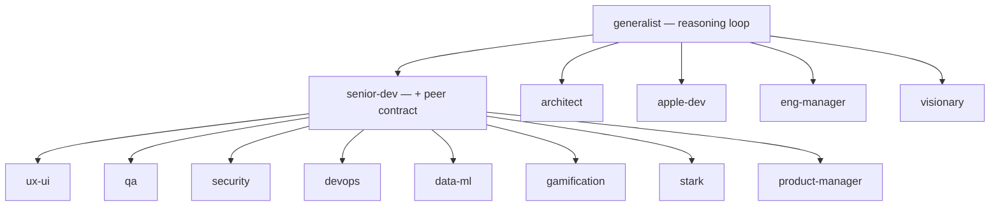
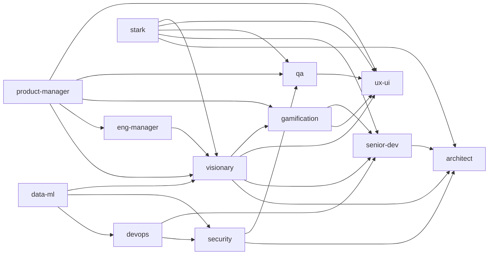
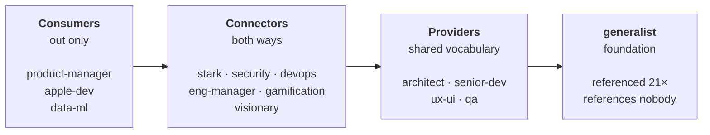
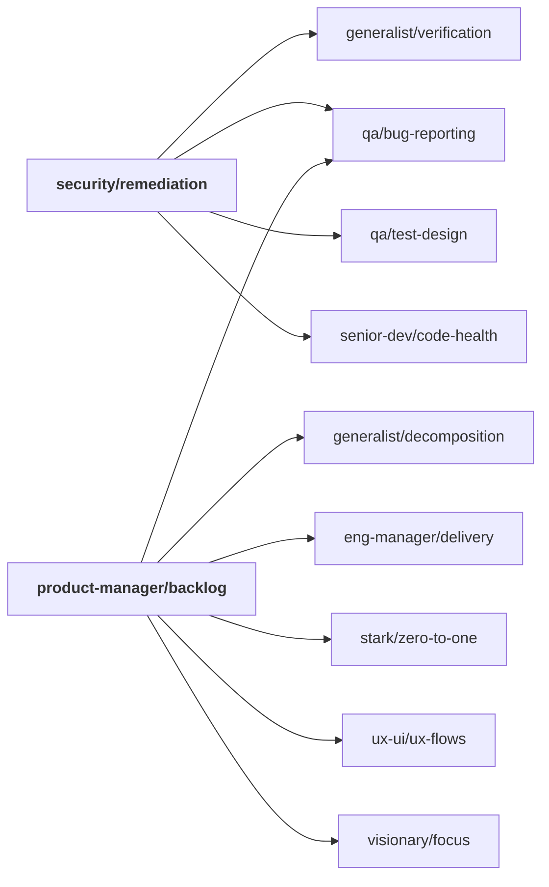

# How the catalog is wired

Three layers of relationship hold this suite together. Every edge on this page
was extracted from the files themselves — none of it is aspirational.

| Layer | Edges | What it means |
|-------|------:|---------------|
| [Inheritance](#1-inheritance) | 21 | Structural. `install.py` inlines the parent's `CORE.md` into the child. |
| [Agent handoffs](#2-agent-handoffs) | 26 | Editorial. An agent names who takes over when a problem stops being its own. |
| [Skill references](#3-skill-references) | 90 | Compositional. A skill points at another skill instead of duplicating it. |

---

## 1. Inheritance

`generalist` carries the reasoning loop — evidence ladder, verify-before-agreeing,
reproduce-before-fixing. `senior-dev` adds the **Peer Contract** (disagree once
with evidence then commit, pull your weight, flag scope creep), which eight
agents adopt on top.



The eight peer agents declare **both** parents directly (21 edges in the files);
the graph draws the layering instead. `install.py` walks it transitively, so each
one gets both `CORE.md` files inlined and stays self-contained after install.

---

## 2. Agent handoffs

Who routes work to whom, from the links in each `AGENTS.md`.



Note that `apple-dev`, `data-ml` and `product-manager` appear only as sources.
No agent currently hands off *to* them. `eng-manager`'s
[`orchestration`](eng-manager/skills/orchestration/SKILL.md) skill carries the
full routing map for all 14 and does cover them — so routing works, but
peer-to-peer handoff doesn't.

---

## 3. Skill references

The densest layer: **90 cross-agent references** between skills (plus 92 sibling
references inside each agent). This is where "compose, don't duplicate" actually
lives — `security/remediation` doesn't re-explain how to write a bug report, it
points at `qa/bug-reporting`.

### Dependency direction

Counting cross-agent skill references per agent reveals a clean one-way flow:



That direction is the catalog practising what `architect` preaches: dependencies
point inward toward stable things. `generalist` is referenced 21 times and
references nothing — it's the innermost ring. The three consumers are leaves.

| Agent | Referenced by others | References others |
|-------|---------------------:|------------------:|
| `generalist` | **21** | 0 |
| `architect` | 13 | 1 |
| `senior-dev` | 13 | 4 |
| `qa` | 9 | 3 |
| `ux-ui` | 9 | 2 |
| `stark` | 8 | 13 |
| `gamification` | 6 | 4 |
| `visionary` | 4 | 4 |
| `devops` | 3 | 6 |
| `eng-manager` | 2 | 7 |
| `security` | 2 | 9 |
| `apple-dev` | 0 | 13 |
| `data-ml` | 0 | 9 |
| `product-manager` | 0 | 15 |

### The load-bearing skills

Six skills carry most of the weight. Change one of these and the blast radius is
wide — they're the catalog's shared vocabulary.

| Skill | Consumed by | Why it's load-bearing |
|-------|------------:|-----------------------|
| [`generalist/verification`](generalist/skills/verification/SKILL.md) | 8 agents | The evidence ladder every agent stands on before claiming anything |
| [`architect/tradeoffs`](architect/skills/tradeoffs/SKILL.md) | 6 agents | The shared method for expensive-to-reverse decisions |
| [`ux-ui/ux-flows`](ux-ui/skills/ux-flows/SKILL.md) | 6 agents | Flows and states — the common language for what a product *does* |
| [`generalist/decomposition`](generalist/skills/decomposition/SKILL.md) | 4 agents | Breaking work into independently verifiable steps |
| [`senior-dev/fullstack-boundaries`](senior-dev/skills/fullstack-boundaries/SKILL.md) | 4 agents | Where the contract between client and server is defined |
| [`qa/bug-reporting`](qa/skills/bug-reporting/SKILL.md) | 4 agents | Reproduction-first reporting, reused by security and management |

### What composition looks like in practice

Two skills from opposite ends of the catalog, and what each one pulls in rather
than restating. Note they meet at `qa/bug-reporting` — a security fix report and
a product backlog item both need the same reproduction discipline, and neither
re-invents it.



### Skills with no cross-agent consumers

Eighteen of 45 are referenced only inside their own agent. That is not
automatically a defect — `apple-dev/shipping` (App Store, notarization) is
genuinely domain-bound. But `security/threat-modeling` and
`ux-ui/visual-craft` are general enough that nobody citing them is worth a look.

```
apple-dev/       code-review · debugging · shipping · state-architecture
data-ml/         data-pipelines · llm-integration · ml-modeling
product-manager/ backlog · discovery · stakeholders
security/        remediation · threat-modeling
eng-manager/     orchestration · team-health
devops/          ci-cd
gamification/    game-mechanics
ux-ui/           visual-craft
visionary/       inspire
```

---

## Reproducing these numbers

Every figure here comes from parsing the markdown links in the catalog. The
edges are `../{agent}/AGENTS.md` references (inheritance vs. handoff decided by
whether the trigger phrase `reasoning model` / `peer contract` sits within 140
characters of the link — the same rule `install.py` uses in `scan_refs`) and
`(../)+{skill}/SKILL.md` references between skills.
