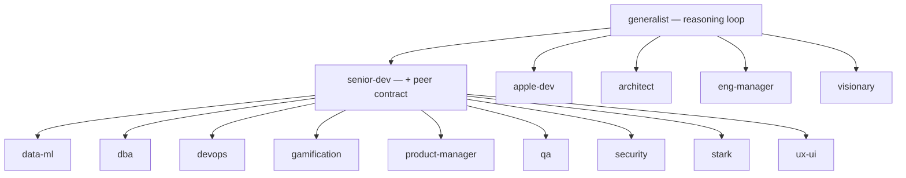
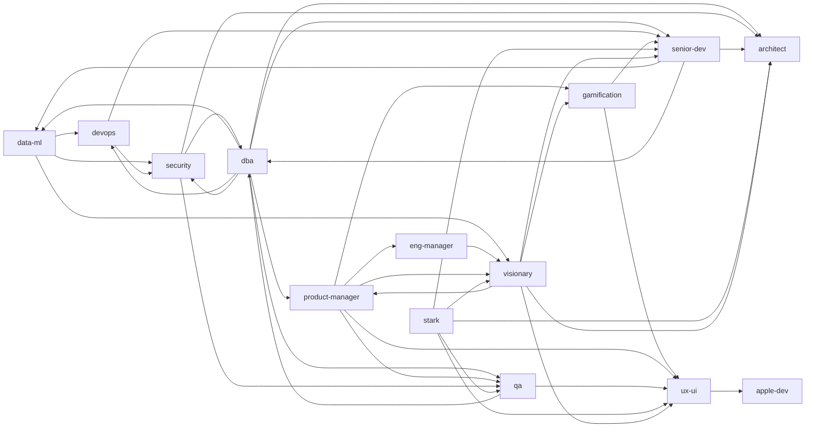
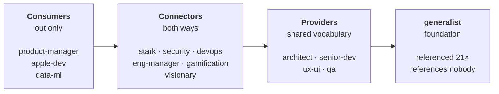
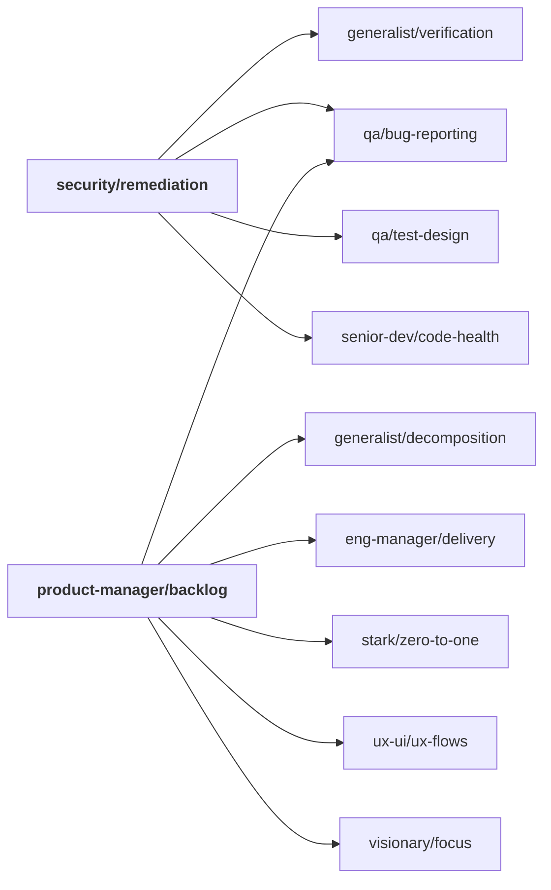

# How the catalog is wired

Three layers of relationship hold this suite together. Every edge on this page
was extracted from the files themselves — none of it is aspirational.

<!-- BEGIN:summary -->
| Layer | Edges | What it means |
|-------|------:|---------------|
| [Inheritance](#1-inheritance) | 23 | Structural. `install.py` inlines the parent's `CORE.md` into the child. |
| [Agent handoffs](#2-agent-handoffs) | 39 | Editorial. An agent names who takes over when a problem stops being its own. |
| [Skill references](#3-skill-references) | 99 | Compositional. A skill points at another skill instead of duplicating it. |
<!-- END:summary -->

---

## 1. Inheritance

`generalist` carries the reasoning loop — evidence ladder, verify-before-agreeing,
reproduce-before-fixing. `senior-dev` adds the **Peer Contract** (disagree once
with evidence then commit, pull your weight, flag scope creep), which eight
agents adopt on top.

<!-- BEGIN:inheritance -->

<!-- END:inheritance -->

The eight peer agents declare **both** parents directly (21 edges in the files);
the graph draws the layering instead. `install.py` walks it transitively, so each
one gets both `CORE.md` files inlined and stays self-contained after install.

---

## 2. Agent handoffs

Who routes work to whom, from the links in each `AGENTS.md`.

<!-- BEGIN:handoffs -->

<!-- END:handoffs -->

<!-- BEGIN:isolated -->
Every agent is reachable: each one is either handed work by another or has its skills cited by another. `generalist` and `stark` receive no peer-to-peer handoff but are cited heavily at the skill level — reached through what they teach, not through routing.
<!-- END:isolated -->

### Terminal agents are not a defect

Several agents route work outward to nobody. That is deliberate, and the reason
differs per agent:

- **`architect`** is consultative. You bring it a decision, it returns an
  analysis, and you go back to your own work — *who acts on its findings is the
  caller's call, not the architect's.* It is also the catalog's most depended-on
  advisor (15 inbound skill references against 1 outbound), which by rule 4 of
  its own judgment — *"boundaries are the product; business logic depends on
  nothing"* — is exactly what an inner ring should look like.
- **`apple-dev`** is a platform silo. Nothing else in the catalog touches Swift
  or iOS, so there is no peer to route to at the agent level — but it composes
  with ten skills across six agents, so it is connected where connection is
  useful.
- **`stark`** and **`generalist`** are entered directly rather than delegated
  to: you reach for stark in a crisis, and every agent already carries the
  generalist loop by inheritance.

Adding return edges was tried and reverted. The concrete failure was overlapping
triggers: `security` routes boundary-caused fixes *to* `architect`, so an
`architect → security` edge for "boundary problems with a trust implication"
makes the same finding ping-pong between them. A handoff is only worth adding
when its trigger cannot fire in both directions on one problem.

---

## 3. Skill references

The densest layer: **90 cross-agent references** between skills (plus 92 sibling
references inside each agent). This is where "compose, don't duplicate" actually
lives — `security/remediation` doesn't re-explain how to write a bug report, it
points at `qa/bug-reporting`.

### Dependency direction

Counting cross-agent skill references per agent reveals a clean one-way flow:



That direction is the catalog practising what `architect` preaches: dependencies
point inward toward stable things. `generalist` is referenced 21 times and
references nothing — it's the innermost ring. The three consumers are leaves.

<!-- BEGIN:refcounts -->
| Agent | Referenced by others | References others |
|-------|---------------------:|------------------:|
| `generalist` | **23** | 0 |
| `senior-dev` | 15 | 4 |
| `architect` | 14 | 1 |
| `ux-ui` | 9 | 2 |
| `qa` | 9 | 3 |
| `stark` | 8 | 13 |
| `gamification` | 6 | 4 |
| `devops` | 5 | 6 |
| `visionary` | 4 | 4 |
| `security` | 3 | 9 |
| `eng-manager` | 2 | 7 |
| `data-ml` | 1 | 9 |
| `dba` | 0 | 9 |
| `apple-dev` | 0 | 13 |
| `product-manager` | 0 | 15 |
<!-- END:refcounts -->

### The load-bearing skills

Six skills carry most of the weight. Change one of these and the blast radius is
wide — they're the catalog's shared vocabulary.

<!-- BEGIN:hubs -->
| Skill | Consumed by | Consumers |
|-------|------------:|-----------|
| [`generalist/verification`](generalist/skills/verification/SKILL.md) | 9 agents | apple-dev, architect, data-ml, dba, gamification, product-manager, qa, security, senior-dev |
| [`architect/tradeoffs`](architect/skills/tradeoffs/SKILL.md) | 6 agents | data-ml, devops, gamification, product-manager, senior-dev, stark |
| [`ux-ui/ux-flows`](ux-ui/skills/ux-flows/SKILL.md) | 6 agents | apple-dev, gamification, product-manager, qa, stark, visionary |
| [`senior-dev/fullstack-boundaries`](senior-dev/skills/fullstack-boundaries/SKILL.md) | 5 agents | data-ml, dba, qa, security, ux-ui |
| [`generalist/decomposition`](generalist/skills/decomposition/SKILL.md) | 4 agents | eng-manager, product-manager, stark, visionary |
| [`qa/bug-reporting`](qa/skills/bug-reporting/SKILL.md) | 4 agents | apple-dev, eng-manager, product-manager, security |
<!-- END:hubs -->

Why each one carries weight:

- **`verification`** — the evidence ladder every agent stands on before claiming
  anything is done. The single most reused idea in the catalog.
- **`tradeoffs`** — the shared method for decisions that are expensive to
  reverse. Six agents defer to it rather than improvising their own.
- **`ux-flows`** — flows and states: the common language for what a product
  *does*, borrowed even by agents that never draw a screen.
- **`decomposition`** — breaking work into independently verifiable steps.
- **`bug-reporting`** — reproduction-first reporting, reused by security for
  vulnerabilities and by management for triage.
- **`fullstack-boundaries`** — where the contract between client and server
  lives, which is also where QA and security go looking for holes.

### What composition looks like in practice

Two skills from opposite ends of the catalog, and what each one pulls in rather
than restating. Note they meet at `qa/bug-reporting` — a security fix report and
a product backlog item both need the same reproduction discipline, and neither
re-invents it.



### Skills with no cross-agent consumers

Eighteen of 45 are referenced only inside their own agent. That is not
automatically a defect — `apple-dev/shipping` (App Store, notarization) is
genuinely domain-bound. But `security/threat-modeling` and
`ux-ui/visual-craft` are general enough that nobody citing them is worth a look.

<!-- BEGIN:orphan-skills -->
```
apple-dev/       code-review · debugging · shipping · state-architecture
data-ml/         llm-integration · ml-modeling
dba/             data-modeling · migrations · query-performance
eng-manager/     orchestration · team-health
gamification/    game-mechanics
product-manager/ backlog · discovery · stakeholders
security/        threat-modeling
ux-ui/           visual-craft
visionary/       inspire
```
<!-- END:orphan-skills -->

---

## Reproducing these numbers

Every figure here comes from parsing the markdown links in the catalog. The
edges are `../{agent}/AGENTS.md` references (inheritance vs. handoff decided by
whether the trigger phrase `reasoning model` / `peer contract` sits within 140
characters of the link — the same rule `install.py` uses in `scan_refs`) and
`(../)+{skill}/SKILL.md` references between skills.
